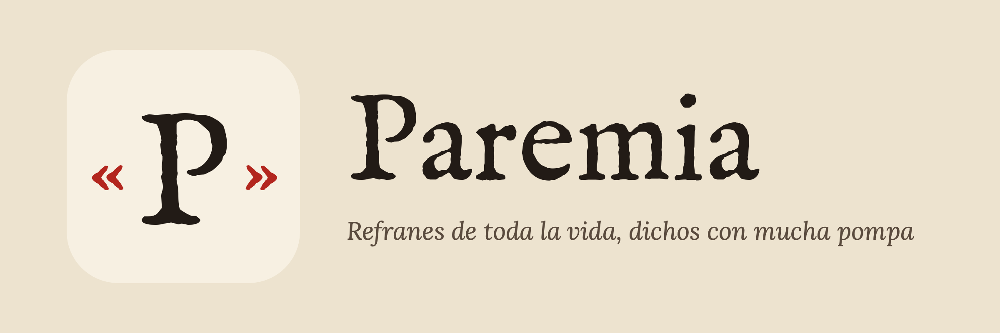

# Paremia



Juego diario de refranes. Cada día se publican **tres refranes españoles
reescritos en lenguaje pedante, burocrático o técnico**, y hay que adivinar el
original:

> «Resulta preferible un ave efectivamente bajo custodia manual que un centenar
> de ellas en régimen de vuelo libre.» → *Más vale pájaro en mano que ciento volando.*

Bajo el texto aparece el esqueleto del refrán (una casilla por palabra, un hueco
por letra). Se puede destapar palabras a cambio de puntos o rendirse:

| Cómo | Puntos | Al compartir |
| --- | --- | --- |
| Sin pistas | 3 | 🟩 |
| Con una pista | 2 | 🟨 |
| Con dos o más pistas | 1 | 🟨 |
| Rendido | 0 | ⬛ |

Es una PWA estática (HTML, CSS y JavaScript, sin frameworks ni paso de
compilación) que forma parte de la colección de [Almanaque](https://joseleking.github.io/Almanaque/).

## Archivos

| Archivo | Contenido |
| --- | --- |
| `index.html` | Estructura de la página |
| `styles.css` | Estética de refranero viejo, modo oscuro automático |
| `app.js` | Lógica: día, validación tolerante, pistas, puntos, racha, compartir |
| `data/refranes.json` | Contenido: 10 días × 3 refranes |
| `sw.js` | Service worker (funciona sin conexión) |
| `manifest.json` | Datos para instalar la app |
| `icons/` | Iconos de la app (normal, adaptable y `apple-touch-icon`), logo de la cabecera y logotipo horizontal |
| `volver-almanaque.js` | Franja ☜ para regresar a Almanaque (copia de `Almanaque/para-los-juegos/`) |
| `reiniciar/index.html` | Página para borrar el progreso guardado |
| `tests/logic.test.js` | Pruebas de la lógica (Node, sin dependencias) |

## Probar en local

`app.js` carga los refranes con `fetch`, así que hace falta un servidor (abrir
`index.html` con doble clic no funciona):

```sh
python3 -m http.server 8000
```

Y abre <http://localhost:8000>.

- **Forzar un día:** `http://localhost:8000/?dia=4` juega el día 4. Con `?dia=11`
  (o más) se ve el mensaje de fin del prototipo.
- **Empezar de cero:** `http://localhost:8000/reiniciar/` borra la partida, el
  historial y la racha de ese navegador (clave `paremia:v1` del `localStorage`).
- **Pruebas:** `node --test tests/logic.test.js`

## Cambiar la fecha de inicio

Al principio de `app.js`:

```js
var FECHA_INICIO = '2026-10-02';
```

Esa fecha (en hora local del jugador) es el día 1; cada medianoche se pasa al
siguiente. Antes de esa fecha se ve un aviso de «próximamente» y, cuando se
acaban los días del JSON, «Vuelve pronto: estamos afilando más refranes».

## Añadir días

Agrega un objeto al final de `dias` en `data/refranes.json`, con tres refranes
ordenados de fácil a difícil:

```json
{
  "refranes": [
    {
      "original": "Más vale tarde que nunca",
      "variantes": ["Otra forma que también se acepta"],
      "pedante": "Resulta preferible una ejecución con demora que la ausencia total de ejecución.",
      "significado": "Es mejor hacer algo tarde que no hacerlo.",
      "equivalente": { "idioma": "inglés", "texto": "Better late than never." }
    }
  ]
}
```

- `variantes` puede ser `[]`. No hace falta incluir variantes que solo cambien
  tildes, mayúsculas o signos: eso ya se ignora.
- `equivalente` es `null` si no hay. `idioma` se muestra tal cual («En inglés»,
  «En francés»…).
- El esqueleto y el orden de las pistas salen del texto `original`: si lo
  cambias, cambia también el orden en que se destapan las palabras.
- Las pruebas comprueban que haya exactamente 10 días: si añades más, cambia ese
  número en `tests/logic.test.js`.

### Cómo se valida la respuesta

Se pasa a minúsculas y se quitan tildes, signos y espacios dobles. Vale si
coincide con el original o una variante, o si se diferencia en un 15 % o menos
de las letras (distancia de Levenshtein). Hasta el 30 % se avisa con
«¡Casi! Revisa alguna palabra». Fallar no resta puntos.

## Publicar en GitHub Pages

1. Sube los archivos a la rama `main`.
2. En GitHub: **Settings › Pages**.
3. En **Build and deployment**, elige **Deploy from a branch**, rama `main` y
   carpeta `/ (root)`. Guarda.
4. En uno o dos minutos estará en `https://<usuario>.github.io/Paremia/`.

Todas las rutas son relativas, así que funciona dentro de ese subdirectorio.

**En cada publicación** sube `CACHE_VERSION` en `sw.js` (`'v1'` → `'v2'`…) para
que quien tenga la app instalada reciba la versión nueva. Si cambias
`styles.css` o `app.js`, sube también el `?v=` con el que se cargan en
`index.html`.

## Datos del jugador

Todo se guarda en el `localStorage` del navegador (clave `paremia:v1`): la
partida del día (para no perderla al recargar), el historial de puntuaciones y
la racha de días jugados. No se envía nada a ningún servidor.
